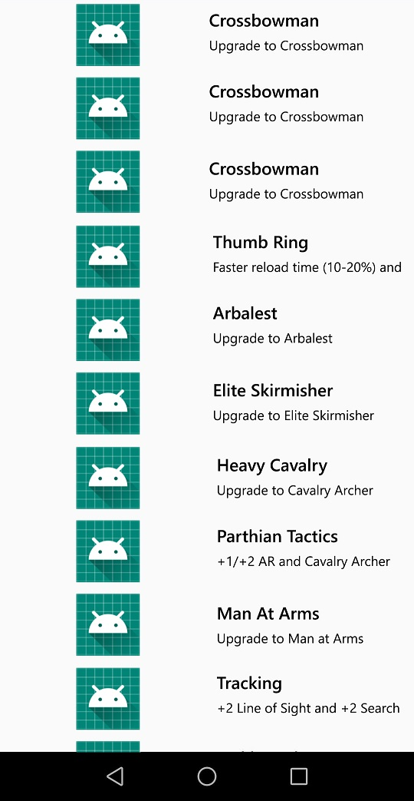

# Application Age Of Empires 2

## Présentation

Simple projet démontrant l'utilisation de la Clean Architecture et du pattern MVC dans une application android codé en Java.

Cette application affiche les différentes technologies de Age Of Empires 2.

## Consignes respectées : 

- Clean Architecture & MVC
- Appels REST
- Ecrans : 2 activités
- Affichage d'une liste dans un RecyclerView
- Affichage du détail d'un item de la liste
- Utilisation des fragments
- Ajout d'un système de recherche avec le nom de la technologie

## Fonctionnalités: 

### Premier écran 

Affiche la liste des technologies disponibles. On peut faire une recherche sur la technologie que l'on veut avec son nom.

### Deuxième écran

Afiche des informations sur les technologies demandées. 

## Resultat :

Ce projet m'a permis d'en apprendre plus sur les RecyclerView pour les trier ainsi que d'améliorer en général ma connaissance de Git et Android Studio. J'ai pu ajouter des fragments a mon application et faire fonctionner un systeme de recherche sur une RecyclerView